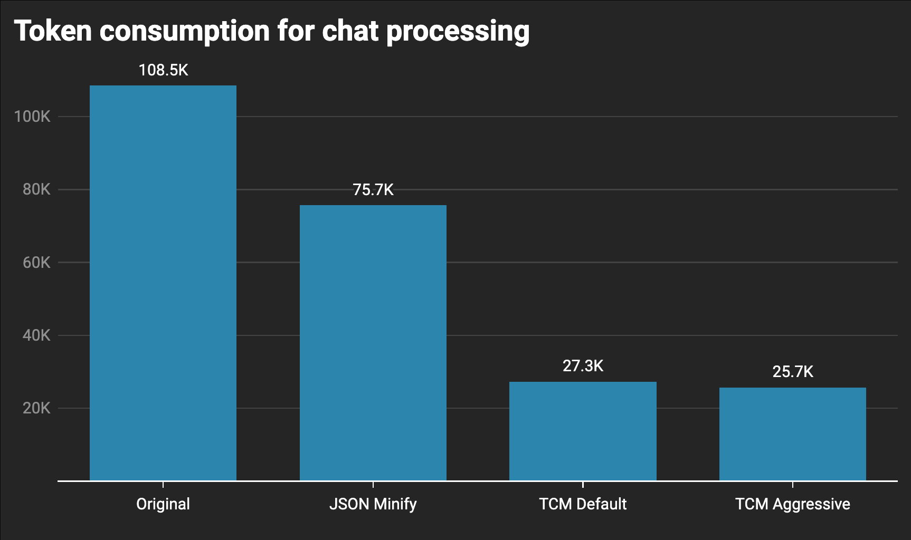
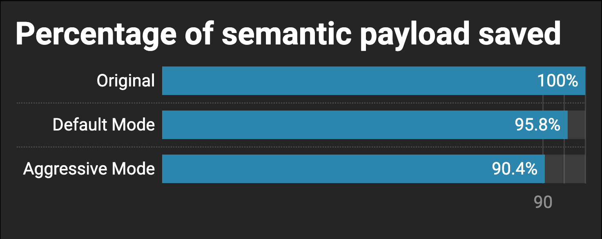

# TCM: TeleChat Minimizer
[](https://raw.githubusercontent.com/andr13/telechat-minimizer/refs/heads/master/LICENSE)

TCM (**TeleChat Minimizer**) is a Python utility designed to minimize Telegram personal chat export JSON files for efficient use with Large Language Models (LLMs). The script removes unnecessary data, optimizes the output for token efficiency, and maintains the essential semantic content of conversations.

---

## Features

- **Aliases:** Maps participant names to single-character aliases for brevity.
- **Compact Output Format:** Outputs conversations in a token-optimized format, suitable for LLMs.
- **Customizable Minimization:**
  - Remove media-only messages.
  - Remove reaction data.
  - Combine both options for aggressive minimization.
- **Handling Media and Reactions:** Retains placeholders for media (e.g., `[photo]`, `[sticker]`) and captures reactions if required.
- **Flexible Configuration:** Command-line arguments for custom output settings.

---

## Performance Comparison

### 1. Token Efficiency


### 2. Semantic Retention


---

## Usage

### Command Syntax
```bash
python3 telechat-minimizer.py [-h] [--no-media] [--no-reactions] [-a] input_file output_file
```

### Arguments
| Argument         | Description                                                                 |
|------------------|-----------------------------------------------------------------------------|
| `input_file`     | Path to the input JSON file exported from Telegram                        |
| `output_file`    | Path to save the minimized output file                                    |
| `--no-media`     | Exclude media-only messages from the output                              |
| `--no-reactions` | Exclude all reaction data from the output                                |
| `-a, --aggressive` | Equivalent to enabling both `--no-media` and `--no-reactions`            |
| `-h`             | Show help and usage information                                          |

### Example Commands

#### Minimize while keeping media and reactions:
```bash
python3 telechat-minimizer.py chat.json minimized_output.txt
```

#### Aggressive minimization (remove both media and reactions):
```bash
python3 telechat-minimizer.py chat.json minimized_output.txt -a
```

---


## Contribution

Contributions are welcome! Feel free to submit pull requests or open issues for bugs, feature requests, or suggestions.

